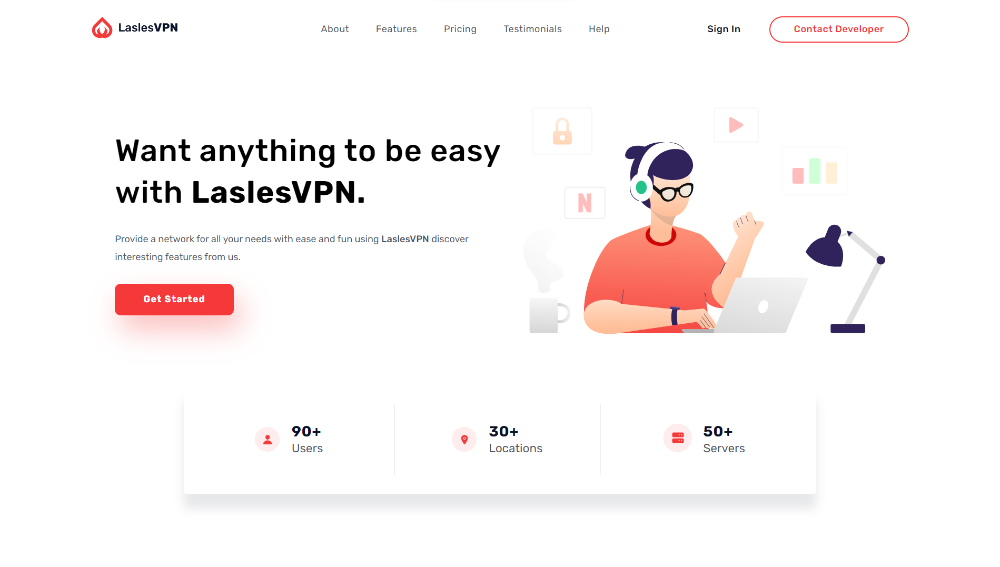

Great! Based on the information you provided, here's a template for your README file:

---

# LaslesVPN Landing Page

Welcome to LaslesVPN Landing Page repository! This landing page is designed to provide a network solution for all your needs with ease and fun. Discover interesting features from LaslesVPN that will make your online experience smooth and secure.

## Features

- **Ease of Use**: LaslesVPN offers a user-friendly interface, making it easy for anyone to navigate and utilize its features.
- **Secure Connection**: Protect your online activities with LaslesVPN's secure connection, ensuring your data remains private.
- **Flexibility**: Whether you're streaming, gaming, or working, LaslesVPN provides a network solution that adapts to your needs.
- **Responsive Design**: Our landing page is designed to be responsive, ensuring a seamless experience across all devices.

## Technologies Used

- HTML
- CSS
- Flexbox
- CSS Grid
- Sass
- JavaScript

## Design

The design for this landing page was provided via Figma, ensuring a visually appealing and cohesive layout.

## Getting Started

To get started with LaslesVPN, simply visit our [website](https://gadmuhammad.github.io/LaslesVPN/) to learn more and sign up for our services.

## Preview

## How to Contribute

If you'd like to contribute to the development of LaslesVPN Landing Page, feel free to fork this repository, make your changes, and submit a pull request.

---
